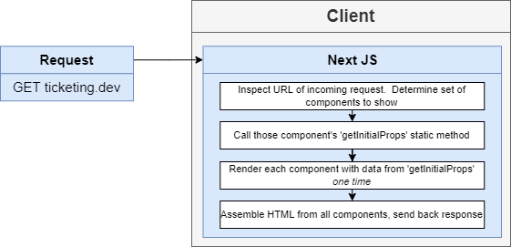
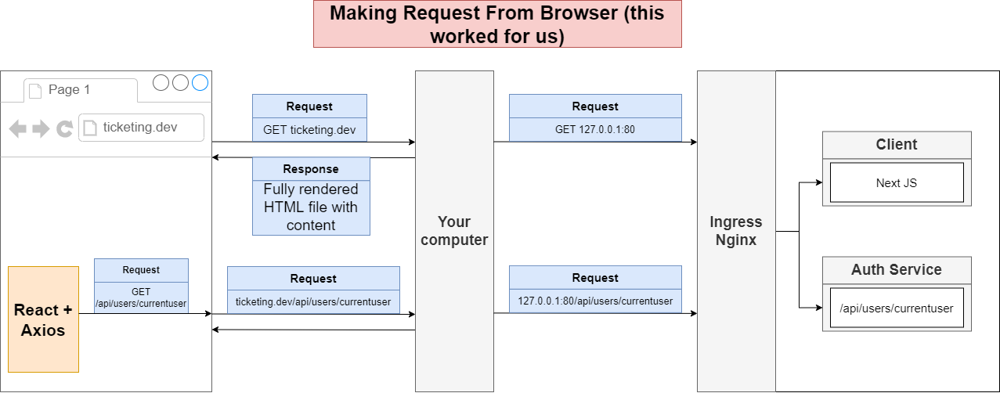
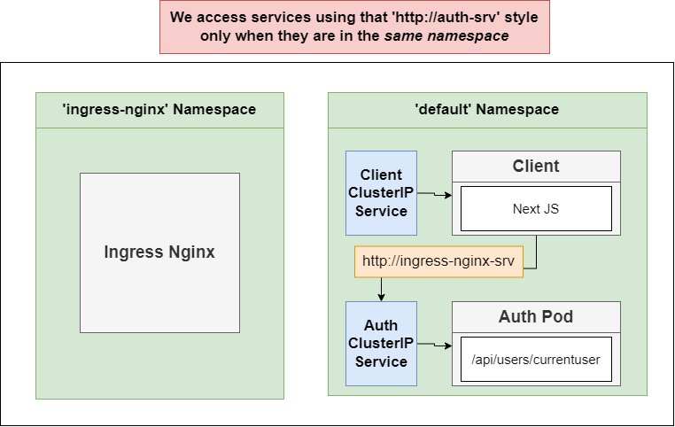
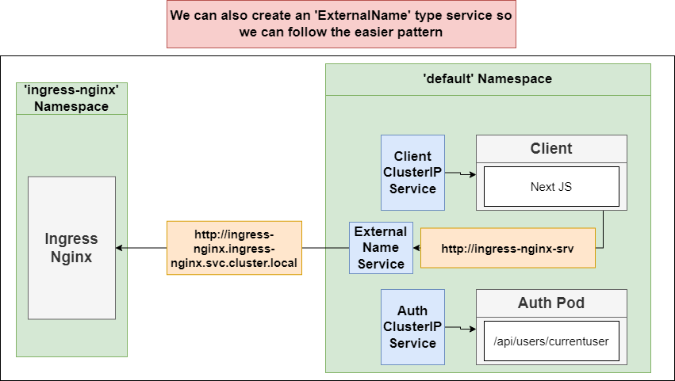

# BookStore Application

This is small project about book store has been implemented microservice architecture with Nodejs 16.2 and React & NextJS.
## Features

- Create CRUD book store web app with React, Next.js and Nodejs.
- Implement Microservice with Nodejs.
- Deployment with Docker, Kubernetes and Skaffold dev

This is prototype for app


## Tech

Blog web app uses a number of open source projects to work properly:

- [React] - HTML enhanced for web apps!
- [NextJS] - Server Side-Rendered!
- [NodeJS] - Evented I/O for the backend
- [Express] - Fast node.js network app framework
- [MongoDB] - Database
- [Typescript] - Strongly typed programming language that builds on JavaScript
- [Kubernetes](https://kubernetes.io/vi/) - Open-source system for automating deployment, scaling, and management of containerized applications
- [Skaffold] - Command line tool that facilitates continuous development for Kubernetes-native applications

***
## Introduce System

Architecture


###  1. Client app:

This app is written by Next.js, a framework that provides a common structure for the front-end development of React apps with zero configuration and a single command toolchain. It provides functionalities to create React-based applications with transparent handling of server-side rendering.

Next.js is an open-source development framework built over Node.js that simplifies the process for SSR and offers many other useful features.



This is overview architecture when intergrating client in the system



### 2. Microservices

Describe services:


##### service-auth
This service will receive request from client to handle authentication and authorization for user. 


Refer to [this link](documents/docs/Authentication/jwt-vs-cookie.md) to get more information about authentication and authorization of auth-service.

### 3. Database

Type of resource


### 4. Infrastructure

#### Kubernetes





#### Ingress-nginx

What is Ingress? 
Ingress exposes HTTP and HTTPS routes from outside the cluster to services within the cluster. Traffic routing is controlled by rules defined on the Ingress resource.

Here is a simple example where an Ingress sends all its traffic to one Service:
***

## Installation In Local
#### 1. Client

##### - Running unit tests

TBA

##### - Running client
Run `npm run dev`


***
## Development

Want to contribute? Great!

Bookstore app uses Docker + Kubernetes  + Skaffold for fast developing.
Make a change in your file and instantaneously see your updates!
This is all step to setup and deploy this project on Kubernetes.

First step:

```
Windown and Mac
Install Docker desktop on machine
```

Second step (Kubernetes setup):

```sh
1. Enable Kubenertes on Docker desktop
2. Setup ingress-nginx (https://kubernetes.github.io/ingress-nginx/deploy/)
```

Third step (Update host var)
```
Add this line to host var file:
127.0.0.1   bookstore
```

Last step (Start deploy and runing webapp)

```sh
 1. Install Skaffold dev https://skaffold.dev/
 2. Run command to start project:
    cd book-store-app
    Skaffold dev
```

Verify the deployment by navigating to your server address in
your preferred browser.

```sh
bookstore.com
```


