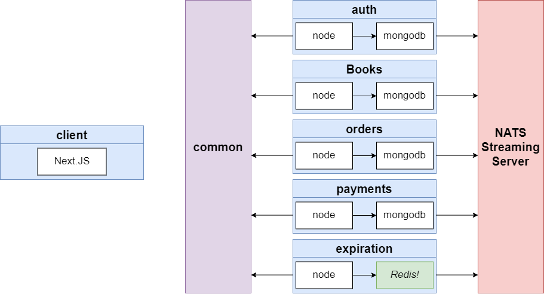

# BookStore Application

This is small project implement microservice with Nodejs 16.2 and Angular 11.
## Features

- Create CRUD blog web app with Angular and Nodejs.
- Implement Microservice with Nodejs.
- Deployment with Docker, Kubernetes and Skaffold dev

This is prototype for app


## Tech

Blog web app uses a number of open source projects to work properly:

- [Angular] - HTML enhanced for web apps!
- [NodeJS] - evented I/O for the backend
- [Express] - fast node.js network app framework [@tjholowaychuk]
- [Kubernetes](https://breakdance.github.io/breakdance/) - Open source
- [Skaffold] - duh

***
## Introduce System

Architecture



###  1. Client app:
This one will be write by Angular 11. It will have some feature like:

### 2. Microservices

Describe services:



##### service-auth
This service will receive request from client to create or get post for user. 



##### service-comments
This service will receive request from client to create or get comments for user. 

##### service-query
This service is about presentation logic, It will join two resource (Posts service and Comments Service).

##### service-moderation
This service will moderate user comments to decide whether to approve or not.

##### event-bus
This service will be the place where all services can communicate with each other

### 3. Database

Type of resource



***

## Installation In Local
#### 1. Client

##### - Build

Run `ng build` to build the project. The build artifacts will be stored in the `dist/` directory.

##### - Running unit tests

Run `ng test` to execute the unit tests via [Karma](https://karma-runner.github.io).

##### - Running end-to-end tests

Run `ng e2e` to execute the end-to-end tests via a platform of your choice. To use this command, you need to first add a package that implements end-to-end testing capabilities.

***
## Development

Want to contribute? Great!

Blog app uses Docker + Kubernetes  + Skaffold for fast developing.
Make a change in your file and instantaneously see your updates!
This is all step to setup and deploy this project on Kubernetes.

First step:

```
Windown and Mac
Install Docker desktop on machine
```

Second step (Kubernetes setup):

```sh
1. Enable Kubenertes on Docker desktop
2. Setup ingress-nginx (https://kubernetes.github.io/ingress-nginx/deploy/)
```

Third step (Update host var)
```
Add this line to host var file:
127.0.0.1   posts.com
```

Last step (Start deploy and runing webapp)

```sh
 1. Install Skaffold dev https://skaffold.dev/
 2. Run command to start project:
    cd blog-web-applications
    Skaffold dev
```

Verify the deployment by navigating to your server address in
your preferred browser.

```sh
posts.com
```


