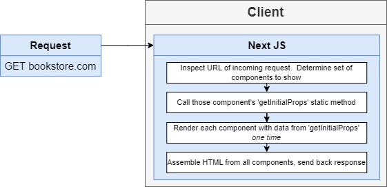

# BookStore Application

This is small project about book store has been implemented microservice architecture with Nodejs 16.2 and React & NextJS.
## Features

- Create CRUD book store web app with React, Next.js and Nodejs.
- Implement Microservice with Nodejs.
- Deployment with Docker, Kubernetes and Skaffold dev.

This is prototype for app


## Tech

Bookstore app uses a number of open source projects to work properly:

- [React](https://reactjs.org/) - A JavaScript library for building user interfaces!
- [NextJS](https://nextjs.org/) - A flexible React framework that gives you building blocks to create fast web applications.
- [NodeJS](https://nodejs.dev/) - As an asynchronous event-driven JavaScript runtime, Node.js is designed to build scalable network applications.
- [Express](https://expressjs.com/) - Fast node.js network app framework.
- [Inversify](https://inversify.io/) - InversifyJS A powerful and lightweight inversion of control container for JavaScript & Node.js apps powered by TypeScript..
- [MongoDB](https://www.mongodb.com/) - A document database with the scalability and flexibility that you want with the querying and indexing that you need.
- [Redis](https://redis.io/) - Redis is an open source (BSD licensed), in-memory data structure store used as a database, cache, message broker, and streaming engine.
- [Typescript](https://www.typescriptlang.org/) - Strongly typed programming language that builds on JavaScript.
- [Kubernetes](https://kubernetes.io/vi/) - Open-source system for automating deployment, scaling, and management of containerized applications.
- [Skaffold](https://skaffold.dev/) - Command line tool that facilitates continuous development for Kubernetes-native applications.
- [NATS](https://docs.nats.io/) - NATS is a connective technology that powers modern distributed systems.
- [GitHub-Action](https://github.com/features/actions) - Implementing CI/CD with GitHub Actions
- [Stripe-API](https://stripe.com/docs/api?lang=node) - Provide stripe's software and APIs to accept payments, send payouts, and manage businesses online.

***
## Introduce System

Architecture


###  1. Client app:

This app is written by Next.js, a framework that provides a common structure for the front-end development of React apps with zero configuration and a single command toolchain. It provides functionalities to create React-based applications with transparent handling of server-side rendering.

Next.js is an open-source development framework built over Node.js that simplifies the process for SSR and offers many other useful features.



This is overview architecture when intergrating client in the system


### 2. Microservices

Describe services:


#### AUTH-SERVICE
This service will receive request from client to handle authentication and authorization for user [Readme-Auth](auth/Readme.md).
Refer to [this link](documents/docs/authen-author/jwt-vs-cookie.md) to get more information about authentication and authorization of auth-service.


#### BOOK-SERVICE
This service will handle book creation and editing. [Readme-Book](books/Readme.md).


#### ORDERS-SERVICE
This service will handle order creation and editing. [Readme-Order](orders/Readme.md).


#### PAYMENTS-SERVICE
This service will handle paying integrate with stripe-API. [Readme-Payment](payments/Readme.md).


#### EXPIRATION-SERVICE
This service will handle expiration since the order is created. [Readme-Expiration](expiration/Readme.md).


### 3. Database

Type of resource


### 4. Infrastructure

#### Kubernetes


https://github.com/kubernetes/dashboard/blob/master/docs/user/access-control/creating-sample-user.md

#### Ingress-nginx

What is Ingress? 
Ingress exposes HTTP and HTTPS routes from outside the cluster to services within the cluster. Traffic routing is controlled by rules defined on the Ingress resource.

Here is a simple example where an Ingress sends all its traffic to one Service:


An Ingress may be configured to give Services externally-reachable URLs, load balance traffic, terminate SSL / TLS, and offer name-based virtual hosting. 
An Ingress controller is responsible for fulfilling the Ingress, usually with a load balancer, though it may also configure your edge router or additional frontends to help handle the traffic.

***
## Development

Want to run on Local? Great!

Bookstore app uses Docker + Kubernetes + Skaffold for fast developing.
Make a change in your file and instantaneously see your updates!

This is all step to set up and deploy this project on Kubernetes.

First step:

```
Windown and Mac
Install Docker desktop on machine
```

Second step (Kubernetes setup):

```sh
1. Enable Kubenertes on Docker desktop
2. Setup ingress-nginx (https://kubernetes.github.io/ingress-nginx/deploy/)
```

Third step (Update host var)
```
Add this line to host var file:
127.0.0.1   bookstore
```

Last step (Start deploy and running web-app)

```sh
 1. Install Skaffold dev https://skaffold.dev/
 2. Run command to start project:
    cd book-store-app
    Skaffold dev
```

Verify the deployment by navigating to your server address in
your preferred browser.

```sh
bookstore.com
```

***
## Documents

#### 1. [Authentication & Authorization In Microservice](./documents/docs/authen-author/jwt-vs-cookie.md)
#### 2. [Continuous integration and continuous delivery](./documents/docs/CI_CD/overview.md)
#### 3. [Error handling in microservice](./documents/docs/error-handler/error-handler.md)
#### 4. [Event Bus In Microservice with NATS streaming](./documents/docs/NATS/nats-1.md)
#### 5. [Open API specification and Swagger](./documents/docs/swagger/swagger-1-openAPI.md)
#### 6. [Testing in microservices](./documents/docs/testing/Testing-Microservices-1.md)
