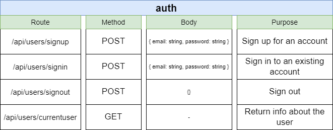

# Auth-Service

This service will receive request from client to handle authentication and authorization for user.

## Installation

This service is using Nodejs version 16.x.x

```bash
npm install
```
## Testing

```bash
npm run eslint && npm run test
```

## Start

```bash
npm run start
```

## Verify



After the service runs, the API for the service will be ready. We can proceed to verify it by testing the API through swagger or postman tools