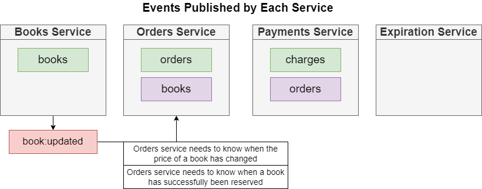

# Book-Service

This service will handle book creation and editing.

## 1. Starting On Local

This service is using Nodejs version 16.x.x

```bash
npm install
### Testing
npm run eslint && npm run test
### Start
npm run start
```

## 2. Routes


After the service runs successfully, the API for the service will be ready.
We can proceed to verify it by testing the API through swagger or postman tools

## 3. Database

Here is the structural database of Book service.

### 3.1 Book Model


## 3. Integrate with NATS


### 3.1. Event Flow

**LISTENER**

- OrderCancelledPublisher


- OrderCreatedPublisher


**PUBLISHER**

- BookCreatedListener


- BookUpdatedListener




