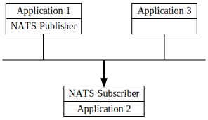

## Event Bus In Microservice

[**Sections 1: NATS Streaming**](./nats-1.md)

[Sections 2: Implement NATS Streaming In Microservice System](./jwt-vs-cookie.md)

## Table of contents

1. What is Nats Streaming?
2. Simple messaging design.

### 1. What is Nats Streaming

NATS is a connective technology that powers modern distributed systems. A connective technology is responsible for addressing, discovery and exchanging of messages that drive the common patterns in distributed systems; asking and answering questions, aka services/microservices, and making and processing statements, or stream processing.

Software applications and services need to exchange data. NATS is an infrastructure that allows such data exchange, segmented in the form of messages. We call this a "message oriented middleware".

With NATS, application developers can:

- Effortlessly build distributed and scalable client-server applications.

- Store and distribute data in realtime in a general manner. This can flexibly be achieved across various environments, languages, cloud providers and on-premises systems.

#### NATS Client Applications

Developers use one of the NATS client libraries in their application code to allow them to publish, subscribe, request and reply between instances of the application or between completely separate applications. Those applications are generally referred to as 'client applications' or sometimes just as 'clients' throughout this manual (since from the point of view of the NATS server, they are clients).

#### NATS Service Infrastructure

The NATS services are provided by one or more NATS server processes that are configured to interconnect with each other and provide a NATS service infrastructure. The NATS service infrastructure can scale from a single NATS server process running on an end device (the nats-server process is less than 20 MB in size!) all the way to a public global super-cluster of many clusters spanning all major cloud providers and all regions of the world such as Synadia's NGS.

#### Connecting NATS Client applications to the NATS servers

To connect a NATS client application with a NATS service, and then subscribe or publish messages to subjects, it only needs to be configured with:

1. URL: A **'NATS URL'**. This is a string (in a URL format) that specifies the IP address and port where the NATS server(s) can be reached, and what kind of connection to establish (plain TCP, TLS, or Websocket).
2. Authentication (if needed): Authentication details for the application to identify itself with the NATS server(s). NATS supports multiple authentication schemes (username/password, decentralized JWT, token, TLS certificates and Nkey with challenge).
***
### 2. Simple messaging design

NATS makes it easy for applications to communicate by sending and receiving messages. These messages are addressed and identified by subject strings, and do not depend on network location.

Data is encoded and framed as a message and sent by a publisher. The message is received, decoded, and processed by one or more subscribers.

With this simple design, NATS lets programs share common message-handling code, isolate resources and interdependencies, and scale by easily handling an increase in message volume, whether those are service requests or stream data.

