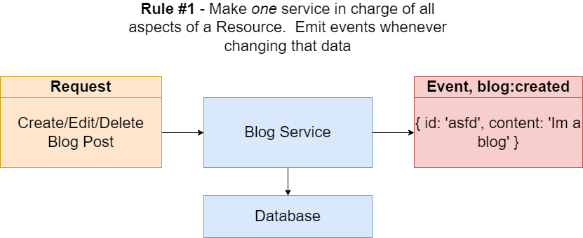
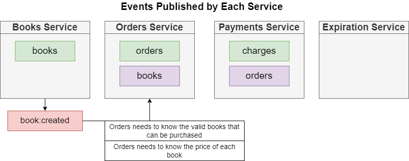
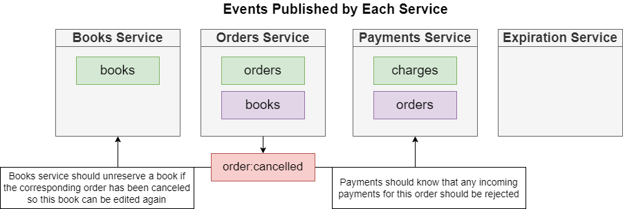

## Event Bus In Microservice

[Sections 1: NATS Streaming](./nats-1.md)

[**Sections 2: Implement NATS Streaming In Microservice System**](./nats-2.md)

## Table of contents

1. Requirements for Event Bus in Microservice.
2. Solution and Implement.
3. List events will be used in the system.
4. Resolve concurrent event listener from multi instance of service. 

### 1. Requirements for Event Bus in Microservice

How to we know what events to create ? and What data should each event contain?
- Deciding on what events to publish and what data they should contain is tricky
- Depends on the purpose of your app and the features it implements
- Also involves thinking about concurrency issues!

***
### 2. Solution and Implement.

==> Some rules of thumb which is applied in this project:
- Make one service in charge of all aspects of a Resource. Emit events whenever change that data
  
- If you don't know how the event will be used, publish all available data about the resource
  
- If you do know how the event will be consumed (and don't expect it to change soon), publish only the required info
  
- Decide the name format for all events

  

Data Held + Replicated by Each Service and all events will be defined in this project

***
### 3. List of events will be used in the system.
Events Published In Each Service

**BOOK-SERVICE:**

**ORDER-SERVICE**

**PAYMENT-SERVICE**

**EXPIRATION-SERVICE**

