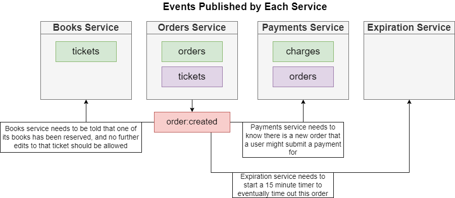

## Event Bus In Microservice

[Sections 1: NATS Streaming](./nats-1.md)

[**Sections 2: Implement NATS Streaming In Microservice System**](./nats-2.md)

## Table of contents

1. Requirements for Event Bus in Microservice.
2. Solution and Implement.
3. List events will be used in the system.
4. Resolve concurrent event listener from multi instance of service. 

### 1. Requirements for Event Bus in Microservice

***
### 2. Solution and Implement.

***
### 3. List of events will be used in the system.
Events Published In Each Service

