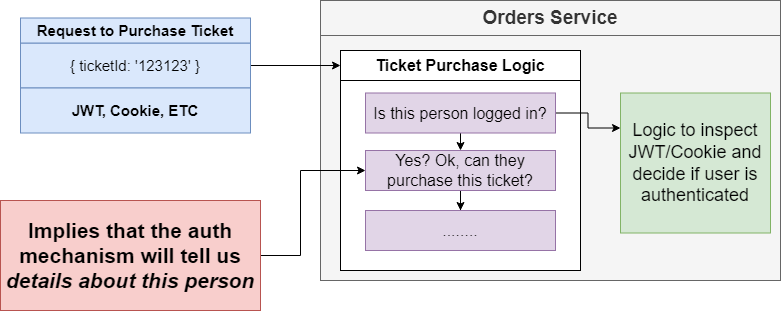
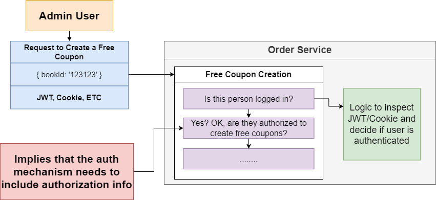
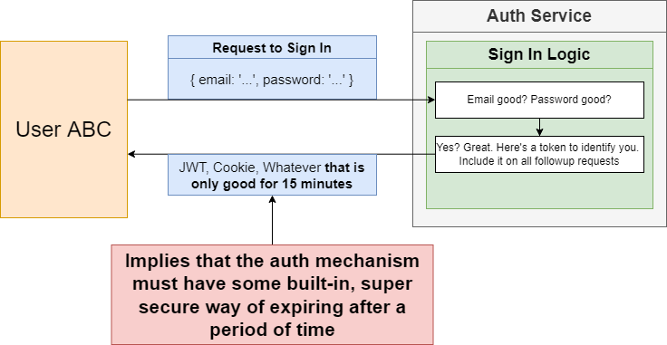
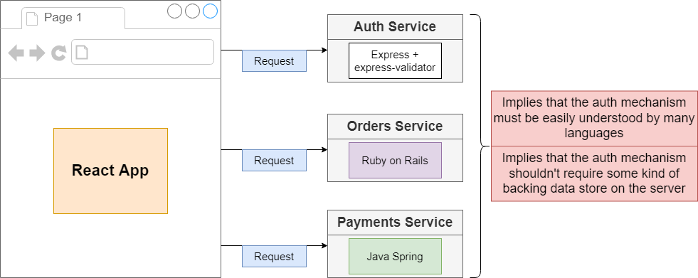
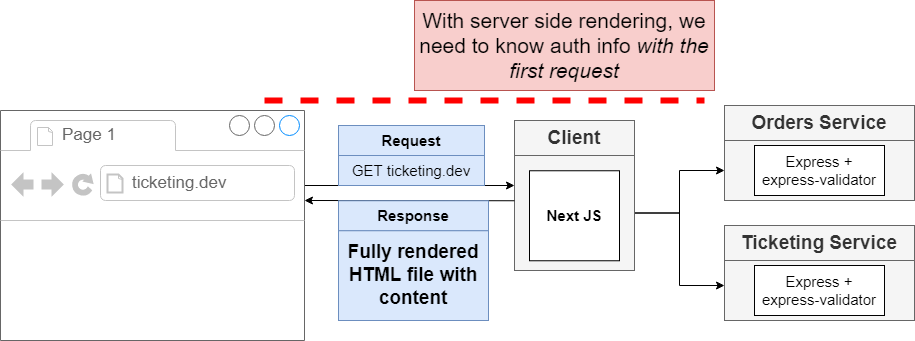
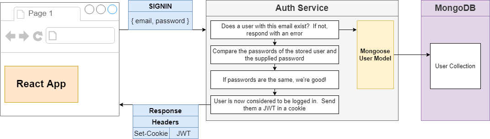
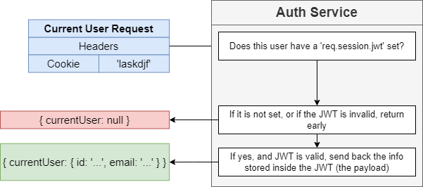

## Authentication and Authorization in microservice

[Section 1: Overview about Cookie and JWT](./jwt-vs-cookie.md)

[**Section 2: Apply Authentication and Authorization into Auth-Service**](./implement-auth-service.md)

# Section 2: Apply Authentication and Authorization into Auth-Service

## Table of contents

1. Requirements for Our Auth Mechanism.
2. Solution and Implement.

## 1. Requirements for Our Auth Mechanism.
### 1.1. Implies that the auth mechanism will tell us details about this person

### 1.2. Implies that the auth mechanism needs to include authorization info

### 1.3. Implies that the auth mechanism must have some built-in, super secure way of expiring after a period of time

### 1.4. Implies that the auth mechanism must be easily understood by many languages and shouldn't require some kind of backing data store on the server

Conclusion:

- Must be able to tell us details about a user

- Must be able to handle authorization info

- Must have a built-in, tamper-resistant way to expire or invalidate itself

- Must be easily understood between different languages.

- Must not require some kind of backing data store on the server

==> With the Requirements for our Auth Mechanism we can use the JWT to handle them.

But the currently, Client is using SSR with React and NextJs, that why we also have problem need to resolve:

With the SSR we need to know auth info with the first request, but the first request cannot be customized in any way in SSR.

## 2. Solution and Implement.

So for this case we will use a customize authentication and authorization with JWT and Cookie. This option can cover all the requirements, which we have listed above.

Here is the flow SignIn for this apply

And when the first request incoming when can check it easy way:

