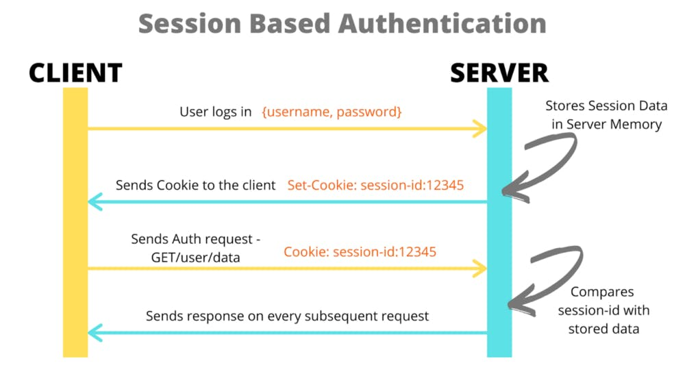
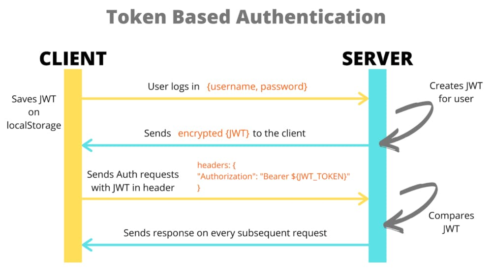

## Authentication & Authorization In Microservice

[**Section 1: Overview about Cookie and JWT**](./jwt-vs-cookie.md)

[Section 2: Apply Authentication and Authorization into Auth-Service](./implement-auth-service.md)

# Section 1: Overview about Cookie and JWT

## Table of contents

1. What is cookie ?
2. What is JWT ?
3. Session Cookies vs. JSON Web tokens — The Approach
4. Session Cookies vs. JSON Web tokens — Advantages and Disadvantages.
5. How to Implement Secure, HTTPOnly Cookies in Node.js with Express
6. Refer.

## 1. What is cookie

The cookie created above is a session cookie: it is deleted when the client shuts down,
because it didn’t specify an Expires or Max-Age directive.
However, web browsers may use session restoring, which makes most session cookies permanent,
as if the browser was never closed.

Read more about HTTP cookies ([this](https://developer.mozilla.org/en-US/docs/Web/HTTP/Cookies?ref=hackernoon.com))



Let’s understand what happens typically when a user logs into any website on the web browser. For instance, the user logs in, the server will create a session for the user and store the session data in the server memory.

There is a session ID created which is stored in a cookie in the client’s browser while the user performs certain activity on the website. On every request that the user makes, a cookie is sent along with it.

The server can then verify the session data on the cookie with the session data stored in the server memory when the user logged in initially. When the user logs out from the website, that session data is deleted from the database and the server memory.

## 2. JWT

In token-based authentication, we use JWTs (JSON Web Tokens) for authentication. This is the widely used method for RESTful APIs.



Here, when the user sends a request for user authentication with the login details, the server creates an encrypted token in the form of JSON Web Token (JWT) and sends it back to the client. When the client receives a token, it means that the user is authenticated to perform any activity using the client.

The JWT is stored on the client side usually in localStorage and it is sent as an unique key of that user when the user requests any data from the server or is performing any activity for that website. So, when the request is received by the server, it validates the JWT for every request that it is that particular user only and then sends the required response back to the client.

This is how the header is sent along with every request to the server :

```sh
headers: {
  "Authorization": "Bearer ${JWT_TOKEN}"
}
```

The user’s state is stored in the JWT on the client side. When the user logs out, the token is deleted from the Client side(localStorage). Thus, most of the data is stored in the client side and accessed directly instead of sending requests to the server.

## 3. Session Cookies vs. JSON Web tokens — The Approach

### 3.1. After successful authentication, (in case of session-cookie approach) the server generates a “cookie”, OR (in case of JWT approach) the server generates an “accessToken”
   Once the user is “authenticated” i.e. the server verifies that the username/password matches with one the userDB,

**Session Cookie based approach:**

```shell
1. Server generates a "sessionId" (signs it using "secret key"), and
   (a) saves the sessionId in a sessionDB, and
   (b) sends a cookie with the sessionId to the browser (client side).
2. The browser (client side) receives the "cookie" in the response from server, and saves it in the "cookie" storage.
3. The browser then includes the "cookie" within every subsequent request to the server.
```

**JWT JSON Web Token approach:**
```shell
1. Server generates an "accessToken", encrypting the "userId" and "expiresIn", with the ACCESS_TOKEN_SECRET,
   and sends the "accessToken" to the browser (client side).
2. The browser (client side) receives the "accessToken" and saves it on the client side.
3. The "accessToken" is included in every subsequent request to the server.

```
### Note:

- In case of the JWT approach, the accessToken itself contains the encrypted “userId”, and the accessToken is not saved within any sessionDB.

  Since no DB is required in case of the “jwt approach”, it is sometimes called “stateless” approach to managing sessions, since no “state” or “session” is saved within a DB (it is contained within the JWT token itself).

  The JWT tokens are sometimes referred to as “Bearer Tokens” since all the information about the user i.e. “bearer” is contained within the token.

- In case of the session cookie based approach, the sessionId does not contain any userId information, but is a random string generated and signed by the “secret key”.

  The sessionId is then saved within a sessionDB. The sessionDB is a database table that maps “sessionId” < — -> “userId”.

  Since sessionIds are stored in a sessionDB, the “session cookie approach” is sometimes called “stateful” approach to managing sessions, since the “state” or “session” is saved within a DB.


### Additional Note:

- In both approaches the client side must securely save the “cookie” or the “jwt token”. The main difference is that in case of the JWT approach the server does not need to maintain a DB of sessionId for lookup.

### In Node JS, the following libraries can be used to implement the above,
- **Cookie** ← using express-session (sessionId string generated by server, and corresponding sessionId saved on server) i.e.

```shell
app.use( session ({ secret: “secret key”}) )
// a sessionId is created by "express-session" and sent in the response as a set-cookie.
// this sessionId can be stored on the server side to a DB eg. MongoDB or Redis or SQL etc.

NOTE: the "secret key" is used to sign the sessionId to verify its integrity when the cookie (sessionId) is returned back to the server on subsequent requests.

```


- **JWT** ← using jsonwebtoken (userId encrypted within the JWT token) i.e.
```shell
const accessToken =
jwt.sign( {userId}, ACCESS_TOKEN_SECRET, {expiresIn: “15m”} )
// Note that the "accessToken" is NOT stored on any server side DB, since there is no need to do so.
```

### 3.2. To maintain sessions, each subsequent request to the server (in case of session-cookie approach) should include the “cookie (sessionId)”, OR (in case of JWT approach) should include the “accessToken”
   

Now that the user is authenticated (and the client side either has a “cookie” OR has an “accessToken”), let’s say the logged in user wants to perform a bunch of actions like adding items to a shopping cart.

For each request made to the server, the server does the following
   
**Steps in Session Cookie based approach,**

```shell
1. Get the "sessionId" from the request "cookie".
2. Verify the "sessionId" integrity using the "secret key".
   Then look up the "sessionId" within the sessionDB on the server and get the "userId".
3. Look up the "userId" within the shoppingCartDB to add items to cart for that userId, or display cart info for that userId.
```

**Steps in JWT based approach,**

```shell
1. Get the "accessToken" from the request "header".
2. Decrypt the "accessToken" i.e the JWT, using ACCESS_TOKEN_SECRET and get the "userId" ---> (there is no DB lookup).
3. Look up the "userId" within the shoppingCartDB to add items to cart for that userId, or display cart info for that userId.
   
```

So notice that in case of the session cookie approach, the server would need to maintain a list of all the sessions in a sessions DB. Also notice that this means that there would be a DB lookup to get the userId . DB look ups are relatively slower than JWT decrypting action.
   
In case of JWT approach, since the JWT token itself contains the (encrypted) userId info, we do not need to perform a “look up” to get the userId. The moment the server decrypts the JWT token, it will get the userId.
   
(NOTE: only the servers that have the shared ACCESS_TOKEN_SECRET can decrypt the JWT token).
   
This allows for multiple servers to be scaled up separately and without the need to have a current copy of the sessionId DB on all servers, or have all servers access a common sessionDB.
   
As long as a server has the same ACCESS_TOKEN_SECRET that was used to generate the JWT token, that server can decrypt the JWT token and get the userId.


## 4. Session Cookies vs. JSON Web tokens — Advantages and Disadvantages

- ### Session Cookies approach:

**Advantages**

On logout, since the sessionId is removed from the database, we have a precision logout i.e. logout occurs at the moment the sessionId is removed from the sessionDB

**Disadvantages**

Needs an additional DB lookup within the sessionId table to get the userId, DB look ups are relatively slower than JWT decrypting action.
Individual servers cannot be scaled separately since they would need to share the sessionDB.

- ### JWT (JSON Web token) approach:

**Advantages**

Since userId is got by decrypting the JWT token, no DB call is required to get userId, so somewhat faster that session approach.
Servers can be scaled separately, without the need share sessionDB. This makes the JWT approach a great option for micro-services architecture.
The same token can be used to authenticate on different servers (as long as server has the access_token_secret), without the need to share sessionDB,
This also allows for a completely separate authentication server, that can be solely responsible to issue “accessTokens” and “refreshTokens”.

**Disadvantages**

Since JWT tokens cannot be “invalidated” (without maintaining them in a shared db), in JWT approach the logout length precision is set by the expiration length of the access_token. However the “access_token” lifespan can be kept short (typically 10 to 15 mins), so that tokens are automatically “invalidated” after the duration.
Anti-pattern: Sometimes additional and unnecessary information is stored in the JWT. The JWT token should primarily contain user information, and the data authorized to be accessed by that user should be provisioned and managed as a separate service on that respective server.


## 5. How to Implement Secure, HTTPOnly Cookies in Node.js with Express

https://cheatcode.co/tutorials/how-to-implement-secure-httponly-cookies-in-node-js-with-express

## 6. Refer

- https://hackernoon.com/using-session-cookies-vs-jwt-for-authentication-sd2v3vci
- https://medium.com/@prashantramnyc/difference-between-session-cookies-vs-jwt-json-web-tokens-for-session-management-4be67d2f066e

