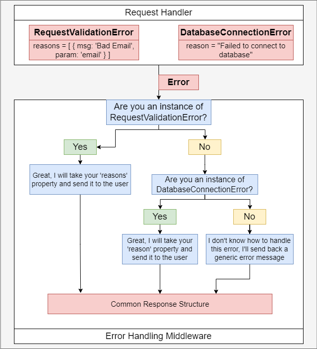

Error handling:

In micro service, that each service throw structure of error different with other services,
that is big matter when the front end have to handle very much coding to get the messsage error.

So that why we need to have a consistently structured for whole services

1. We will go to Difficulty when handling error:

- We must have a consistently structured response from all server, no matter what went wrong.

==> Solution: Write an error handling middleware to process error, give them a consistent structure, and send back to the browser

- A billion things can to wrong, not just validation of inputs to a request handler. Each of there need to be handled
consistently

==> Solution: Make sure we capture all possible error using Express's error handling mechanism (call the 'next' function)






