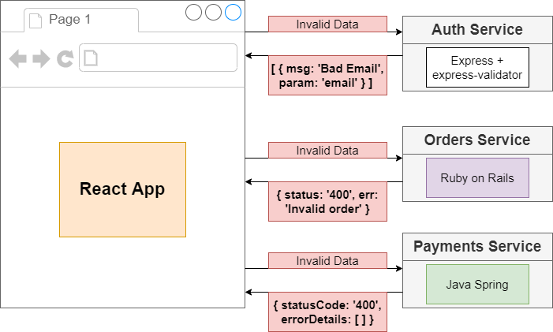
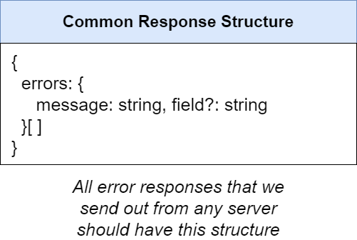

# Error handling in microservice

## Table of contents

1. The matter when handler error in microservice
2. What is the solution to handler error
3. Implement in project

## 1. Problem

In micro service, if each service throws different error structure, then
that is a big matter when the front end has to deal with a lot structure of error body to get needed contend




## 2. Solution
- We need to have an easy-to-use system for handling any kind of error and sending an identically-structured response

So that why we need to have a consistently structured for whole services
For example:


#### We will go to difficulty when handling error:

- We must have a consistently structured response from all server, no matter what went wrong.

==> Solution: Write an error handling middleware to process error, give them a consistent structure, and send back to the browser

- A billion things can to wrong, not just validation of inputs to a request handler. Each of there need to be handled
consistently

==> Solution: Make sure we capture all possible error using Express's error handling mechanism (call the 'next' function)




## 3. Implement

This is structure diagram has been implemented in auth service

