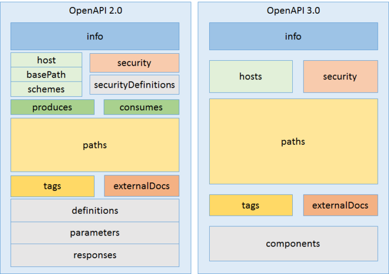

## Swagger module

[Section 1: Overview about Open API specification and Swagger](./swagger-1-openAPI.md)

[**Section 2: Open API specification**](./swagger-2-openAPI.md)

# Section 2: Open API specification

## Table of contents

1. Difference between Swagger version 2.0 vs Open API version 3.0 
2. Basic Structure Swagger version 2.0
3. References.

## 1. Difference between Swagger version 2.0 vs Open API version 3.0 



### 1.1 Version

In 2.0 spec there is a property called `swagger` which tells you the version of spec, for example:

```"swagger": "2.0"```

This is replaced with new property `openapi`, it should be used as below (using Semantic Versioning 2.0.0):

```"openapi": "3.0.0"```

### 1.2 Multiple Servers

`Swagger spec 2.0` has a placeholder only for one host or one server details and does not have support to have multiple 
server information. This drawback is taken care in `3.0 spec`, so now there is new servers object array where you can 
have host information with any variable placeholders in the host url as well

Example:

``` yml
servers:
  - url: "localhost:{port}/{basePath}"
    description: "The production API server"
    variables:
      port: 
        default: "3038"
      basePath: 
        "default": "swagger"
```

### 1.3 Components

`Open API spec 3.0` provides components object which can contain:

- schemas

Here is an example schemas:

``` yml
  schemas:
    PasswordResetToken:
      type: "object"
      properties:
        _id:
          type: "string"
        resetToken:
          type: "string"
        userId:
          $ref: "#/components/schemas/User"
        userEmail:
          $ref: "#/components/schemas/User"
        expires:
          type: "string"
          format: "date-time"
      xml:
        name: "PasswordResetToken"
```

- parameters

Here is an example parameters:

``` yml
  parameters:
    CredentialInHeader:
      in: "header"
      name: "credential"
      description: "new user"
      required: true
      schema:
        $ref: "#/components/schemas/Credential"
```

- responses

Here is an example responses:

``` yml
  responses:
    200UserResponse:
      description: "successful operation"
      content:
        application/json:
          schema:
            $ref: "#/components/schemas/UserResponse" 
``` 

- examples

Here is an example examples:

``` yml
  example:
    id: "5e8ea5574dc3e21474ca1410"
    name: "hoang vo"
    email: "hoangvo@gmail.com"
    password: "123456"
    services: ["facebook", "google"]
    role: "user"
    picture: "https://avatars0.githubusercontent.com/u/39694887?s=400&u=59950ff114bcff42c34ba5dd5ce9fd8b171fabb8&v=4"
```
 
- security schemes

Here is an example security schemes:

``` yml
  securitySchemes:
    BearerAuth:
      type: http
      scheme: bearer
```

- links
- request bodies
- headers and callbacks. 

This component object won’t affect the API until it is referenced somewhere in the API

> Advantage : If multiple operations of an API needs similar input structure the the input structure can be defined 
under component as request bodies and can be reused in multiple paths

## 2. Basic Structure Open API version 2.0

### 2.1 Overview

`Swagger` can be written in either `JSON` or `YAML`.
You can convert from YAML to JSON, use [this](https://www.json2yaml.com/)

Here is a most basic API specification written in `Swagger 2.0` (written in YAML):

``` yml
swagger: "2.0"
info:
  description: "Express boilerplate for building RESTful APIs"
  version: "1.0.0"
  title: "express-rest-es2017-boilerplate"
host: "localhost:3038"
basePath: "/swagger"
schemes:
- "http"
- "https"
paths:
  /user:
    get:
      summary: "Get a list of users"
      produces:
        - "application/json"
      responses:
        "Successful 200":
          description: "users List of users"
```

### 2.2 Metadata

The `swagger: “2.0”` element explains this is a `Swagger 2.0`. This element is essential

``` yml
swagger: "2.0"
``` 

The `info: ` element explains the title, description and version:

- `title`: This is a required element in info element. The type is “string” and this describes the title of the application.

- `description`: Type of “string”. Includes a short description about the application.

- `version`: A required element. Type of “string”. Includes the version of the API. Not the specification version

Here is an example info element:

``` yml
info:
  description: "Express boilerplate for building RESTful APIs"
  version: "1.0.0"
  title: "express-rest-es2017-boilerplate"
```

### 2.3. Base URL

There is a URL that every REST API paths are appended. The host, basePath and schemes elements describes 
the parts of this URL. Example,  in the above basic definition, the `/user` path is represented like below:

```
<scheme>://<host>/<basePath>/user
```

These elements serves the following purposes:

- `scheme`: These are the transfer protocols used by the API. Swagger 2.0 supports both http and https

- `host`: The domain name or the IP address of the host that serves the API

- `basePath`: This prefixes all the paths defined in the Swagger definition and this is relative 
for the host

Here is an example base URL:

``` yml
host: "localhost:3038"
basePath: "/swagger"
schemes:
- "http"
- "https"
```

### 2.4 Consumes/ Produces

`Consumes` and `Produces` elements define the format of the data that the API accepts and returns

=> These are called MIME types

We can be defined globally(root level of the API) or locally for individual operations

Here is an example globally MIME type definition for both JSON and XML types:

``` yml 
 consumes:
   - "application/json"
   - "application/xml"
 produces:
   - "application/json"
   - "application/xml"
```

### 2.5 Paths and Operations

The `path` element plays an important role in the API specification. Inside this element, we can define what are the 
resources or individual endpoints of the API and what are the HTTP methods used for those endpoints

This is how the paths are defined in global paths section in the definition:

``` yml
paths:
  /auth/register:
  ...
  /auth/login:
  ...
  /user:
  ...
```

### 2.6 Operations

Swagger 2.0 supports the following `HTTP methods`. These `HTTP methods` are called `operations` in Swagger:

- GET
- POST
- PUT
- PATCH
- DELETE
- HEAD
- OPTIONS

A single path can contain multiple operations

> We cannot define two GET methods or two POST methods for the same path even if they have different parameters

Here is a simple path with GET operation:

``` yml 
paths:
  /user:
    get:
      summary: "Get a list of users"
      produces:
        - "application/json"
      responses:
        "Successful 200":
          description: "users List of users"
```

These operations support some optional elements for documentation purposes:

- `summary`: a short summary about the operation
- `description`: a longer description about the operation
- `tags`: used to group operations in swagger UI
- `externelDocs`: allows to refer additional external docs

### 2.7 Parameters

Parameters in Swagger are defined in the parameters section under the operation of the path. There are several types of 
parameters and they have the following elements:

- `in`: types of parameter (can be either “query” or “path”)

- `name` : name of the parameter
 
- `type`: type of the parameter(for primitive value parameters)

- `schema`: for request body

- `description`: a short description about the parameter

Here is a simple path defined with a path parameter:

``` yml
paths:
  /user:
    get:
      summary: "Get a list of users"
      parameters:
      - in: "body"
        name: "body"
        description: "Get a list of users"
        required: true
        schema:
          $ref: "#/definitions/GetListUser"
```

### 2.8 Responses

The `responses` section allows you to define the response format or type you expect from different APIs

The `schema` can define:

- a primitive type(string or integer)

- an object of array type (with `JSON` or `YAML` APIs) — Under “properties” element, 
you can define elements of the object body

A response body also can be defined in the `definitions` section. 
For doing this we have to use `$ref` element under the `schema` element in the response section

Here is an example response element:

``` yml
responses:
  "Successful 200":
    description: "users List of users"
    schema:
      type: "array"
      items:
        $ref: "#/definitions/UserResponse"
```

### 2.9 Input and Output Models

In the `definitions` section, both response bodies and request bodies of the APIs can be defined

Here is the definition of `User` response body:

``` yml
definitions:
  UserResponse:
    type: "object"
    properties: 
      id:
        type: "string"
        description:  "User's id"
      name:
        type: "string"
        description: "User's name"
      email:
        type: "string"
        description: "User's email"
      role:
        type: "string"
        description: "User's role"
      createdAt:
        type: "string"
        format: "date-time"
        description: "Timestamp"
    example:
      id: "5e8ea5574dc3e21474ca1410"
      email: "hoangvo@gmail.com"
      password: "123456"
      name: "hoang vo"
      role: "user"
      createdAt: "2020-04-09 04:32:23.472Z"
```

## 3. References

- https://swagger.io/specification/v2/
- https://blogs.sap.com/2018/01/05/open-api-spec-2.0-vs-3.0/
- https://medium.com/@akilaaroshana/design-apis-easier-than-ever-with-swagger-2-0-60a2ba696d7d