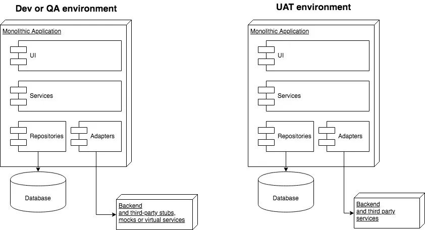
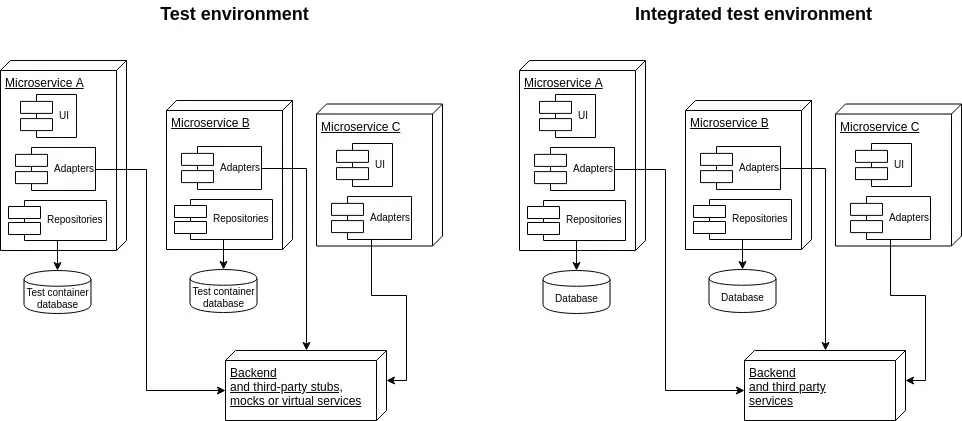

# Testing In Microservices.

[**Section 1: Overview about testing in microservices**](./Testing-Microservices-1.md)

[Section 2: Analyze testing strategies in this project](./Testing-Microservices-2.md)

## Sections 1: Overview about testing in microservices

## Table of contents

1. Overview testing in microservice
2. Using dependencies in your tests
3. Contract testing
4. Summary
5. Refer

## 1. Overview testing in microservice

The combination of a microservice architectural style and container-based infrastructure requires a testing strategy that is compatible with this brave new world. A microservice architecture relies more on over-the-wire (remote) dependencies and less on in-process components, and your testing strategy and test environments need to adapt to these changes.

More over-the-wire communication results in more effort spent testing the connections and contracts between your microservices. Also, several new testing techniques are available to handle dependent components when moving to a container-based infrastructure, which often occurs when adopting microservices.

We optimize your Service Mesh built on Istio. Our trusted, hands-on experts guide you. 24/7 support.

Choose your testing techniques with a perspective on time to market, cost, and risk.

When testing monoliths with techniques like service virtualization, you do not have to test everything together. You can instead divide and conquer, and test individual modules or coherent groups of components. You create safe and isolated environments for developers to test their work. Using service virtualization when testing monoliths allows you to decouple your test environments from dependent components and reduce the impact of issues like:

- difficult to provision or configure dependent components,
- costly test-data setup that takes time,
- teams blocked by other teams not delivering APIs on time, and
- scheduling time on test environments.

When working with microservices, you have more options because microservices are deployed typically in environments that use containers like Docker. In microservice architectures, your teams are likely to use a wider variety of testing techniques. Also, since microservices communicate more over the wire, you need to test the impact of network connections more thoroughly. Using tools and techniques that better fit the new architecture can allow for faster time to market, less cost, and less risk. 

Many IT departments work with or maintain systems developed and deployed in a monolithic architecture. A typical monolithic architecture has these characteristics:

- People working on the application are organized into separate teams of specialists: UI developers, middleware developers, back-end developers, database administrators, and system administrators.

- The governance is conducted centrally by architects — for example, there is a global set of rules for code quality, security guidelines, and testing approach.

- The data is managed centrally, so a monolithic application will typically rely on a single large database.

- The level of automation may be low, with some automated testing but little infrastructure automation.

- The organization of the people working on the application often influences how the code and test environments are organized; this effect is known as Conway’s law. Typically, the code will be split into several layers of components such as UI, services, and repositories. The monoliths will be deployed to shared environments, usually development, QA, and user acceptance testing (UAT). See figure 1.

Many monolithic systems have been built by teams working in functional silos, where, for example, the operations team is a separate entity that works on a separate schedule. The changes required to introduce a containerization approach to an organization like that can be time consuming because it includes provisioning new infrastructure as well as training staff and creating migration plans for the move to the new approach.



This means the techniques for decoupling from dependencies in monolithic architectures are often restricted to those that do not require containers, but instead run in-process or on existing VMs or hardware provisioned by the operations team. The techniques that do not require containerization are:

- using test doubles such as stubs, mocks, or virtual services;

- connecting to real test instances of back-end or third-party systems; and

- contract testing.

Because of Conway’s law, siloed functional teams with complex communication patterns create monoliths with the same complex communication patterns. This means the tools used for service virtualization have to be quite powerful, supporting complex workflows and many technologies (for example, many communication protocols) due to the complexity of the system under test (the monolithic application) and the complexity of the test cases.

Usually, there will be a separate team responsible for creating stubs, mocks, or service virtualization of back-end or third-party services. This often results in contention on the team responsible for service virtualization, leading to lengthy time to market and high maintenance costs of the testing infrastructure.

In a microservice architecture, you typically find:

- Teams are organized around business capabilities such as cross-functional teams of several UI, middleware, and back-end developers, a database administrator, and a DevOps specialist.
- Decentralized governance that allows every team to choose the right tool for their job.
- Decentralized data management that allows each microservice or group of related microservices to manage its own data.
- Testing, deployment, and infrastructure typically are automated with little or no manual intervention.
- This influences what techniques are available for decoupling a microservice from its dependencies for testing purposes. Since there is less need for a homogenous technology stack that fits all teams’ needs, each team will usually have access to more options that fit its specific needs.

The main categories of solutions for testing microservices are those that are already available in monolithic architectures, which are also applicable to microservices, and those designed specifically for microservice architectures.

Methods available in monolithic architectures are using test doubles such as stubs, mocks, or virtual services; connecting to real test instances of back-end or third-party systems; and contract testing.

Methods available for microservice architectures are test containers such as database test containers, service-virtualization test containers, and third-party-service test containers (for example a Redis test container, an ESB test container, or a virtual appliance test container) and legacy in a box.




There have been many articles written and talks given on how to develop a strategy for testing microservices. Here are a few resources that look into doing that:

- “Testing Strategies in a Microservice Architecture”, by Toby Clemson, ThoughtWorks (18 November 2014)
- “Testing of Microservices”, by André Schaffer, Spotify (11 January 2018)
- “Testing Microservices: From development to production”, by Daniel Bryant, JAX London (9 October 2018)

You will be using many of the same testing techniques used for monolithic architectures as well as new techniques involving containers. However, the suitability of different testing techniques may change, since the feedback loops in microservice architectures are tighter because teams are typically colocated and cross-functional.

A common theme in the resources listed above is that you need to manage the dependent components to test microservices in a cost-effective and time-effective way. Depending on your needs, you can choose one of the options listed in this article or a combination of them. Let's discuss those options.

## 2. Using dependencies in your tests

A test environment for testing microservices may use real dependencies instead of test doubles.

There are a few component types that your microservice can communicate within a test scenario: 

1. You can test your microservice with a test instance of another microservice. For example, during testing of microservice A, you connect it to a test instance of microservice B and test them together.
 
2. You can test your microservice with a production instance of another microservice. For example, during testing of microservice A, you connect it to a production instance of microservice B and test them together before releasing microservice A to production.
 
3. You can test a microservice with third-party dependencies. For example, during testing of microservice A, you connect it to a production instance of a third-party system.
 
4. You can test a microservice with legacy non-microservice internal dependencies. For example, during testing of microservice A, you connect it to a test instance of an old mainframe system running on premises.
 
5. You can test a microservice with non-software (hardware) dependencies. For example, during testing of microservice A, you connect it to a hardware device responsible for fulfilling the service.

Next, let's list test-specific dependent components that you can use in your microservice tests instead of the ones listed above.

Of course, you can use so-called test doubles in your microservice tests which pretend to be real dependencies for the purpose of the test. You have several techniques to choose from depending on the type of dependency and problem at hand:

6. A mock (in-process or over the wire/remote) replaces an object the microservice depends on with a test-specific object that verifies that the microservice is using it correctly.
 
7. A stub (in-process or over the wire/remote) replaces an object the microservice depends on with a test-specific object that provides test data to the microservice. The test data can be static or dynamic.
 
8. A simulator (in-process or over the wire/remote) is a smart version of a stub that imitates some of the behaviors of the system the microservice depends on. For example, instead of connecting to a real payment system in a test, you can connect to a simulator that implements a part of the observable payment functionality. 
 
9. Service virtualization (over the wire/remote) is also called API simulation or an API mock. It is the practice of replacing real dependent components with test versions created using powerful service-virtualization tools. Service-virtualization tools allow a simulator-like experience but with less effort from developers and testers. Instead of building a custom test double per dependency, off-the-shelf tools take care of the boilerplate functionality that is common across typical handwritten implementations. Service-virtualization tools generally offer more features than stubs or mocks, like recording requests and responses or built-in support for multiple technologies like HTTP, JMS, FTP, or gRPC.
 
10. You can use an in-memory database to replace a real instance of a database for testing.
 
11. You can run a test container, a test instance of a dependency per build or pipeline inside a container, instead of using an instance shared across many teams, builds, or pipelines. For example, you can use a database test container or a service-virtualization test container.
 
12. You can use a legacy in a box. Instead of relying on a shared test environment, you can run a legacy system in a container. You can configure it in a way that is appropriate for your testing needs.

## 3. Contract testing
Contract testing is a critical piece of the puzzle when using loosely coupled components like microservices.

A contract describes how components communicate and interact with each other, both message formats between components (syntax) as well as behavioral expectations of components (semantics). You use contract testing to verify that contracts between components are honored; this gives you confidence that the components are able to work together. When you use test-specific dependent components (such as test doubles), you can also use contract testing to make sure that they honor the latest or any specific version of the contract. Here are several ways of testing or managing contracts between components:

1. In a contract snapshot test, your test doubles represent a snapshot of a contract between components at a point in time. That snapshot can fall out of date. You can test contract snapshots in an automated way.
 
2. Contract snapshot refreshes allow you to re-record (refresh) the contracts between components. Typically, a refresh will cater for the syntax and partially for the semantics of the contract. See consumer-driven contract testing for more thorough syntax and semantics testing.

3. Consumer-driven contract testing is a component of a complete microservice testing strategy. Consumer-driven contracts are separated into a producer and consumers. Consumer-driven contract testing verifies that the producer provides a contract that fulfils all consumers’ expectations. Consumers verify that the producers still provide the structure of messages and behavior they need.
 
4. Per-contract narrow integration testing can test the contract between the connector module in your microservice and the dependent component. The contract, in this case, is typically more producer driven rather than consumer driven.
 
5. Use contract testing for independent component releases if you want to independently release two dependent components. You must remember to test combinations of the latest and production artifacts.
 
6. End-to-end (E2E) testing means verifying that all components work well together for complete user journeys. This means contracts between components are implicitly validated when exercising the user journey tests across the system.

## 4. Summary

There are many techniques for managing dependent components when testing microservices. The information given here should fill in a few gaps and help you to define your development and test strategy (including the testing pyramid).

In Examining the Tradeoffs of Twelve Techniques - Part 2, we will compare the techniques based on the maturity of a team, pace of change, time to market, costs, and risks.

If you find anything not clear in the article or if you have any project-specific concerns or questions, please contact the authors: Wojciech Bulaty at wojtek@trafficparrot.com and Liam Williams at liam@trafficparrot.com.


## 5. Ref

- https://www.infoq.com/articles/twelve-testing-techniques-microservices-intro/#:~:text=You%20can%20test%20your%20microservice%20with%20a%20production%20instance%20of,microservice%20with%20third%2Dparty%20dependencies.
