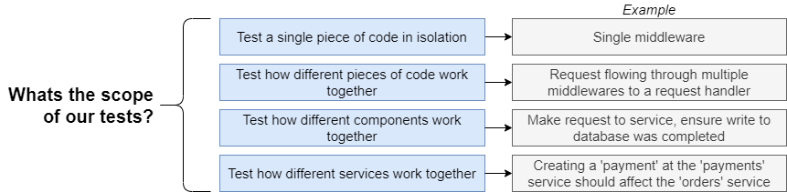
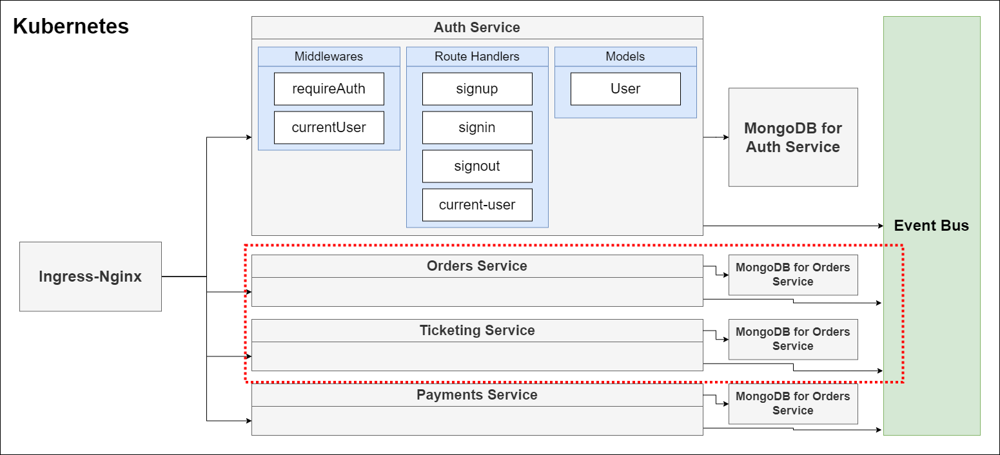
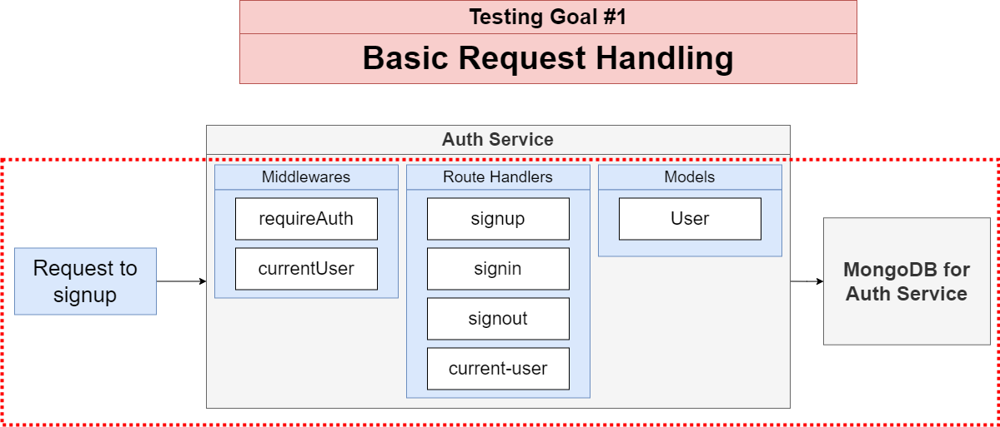
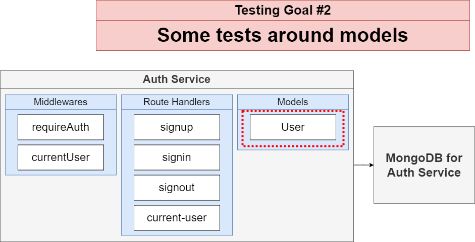
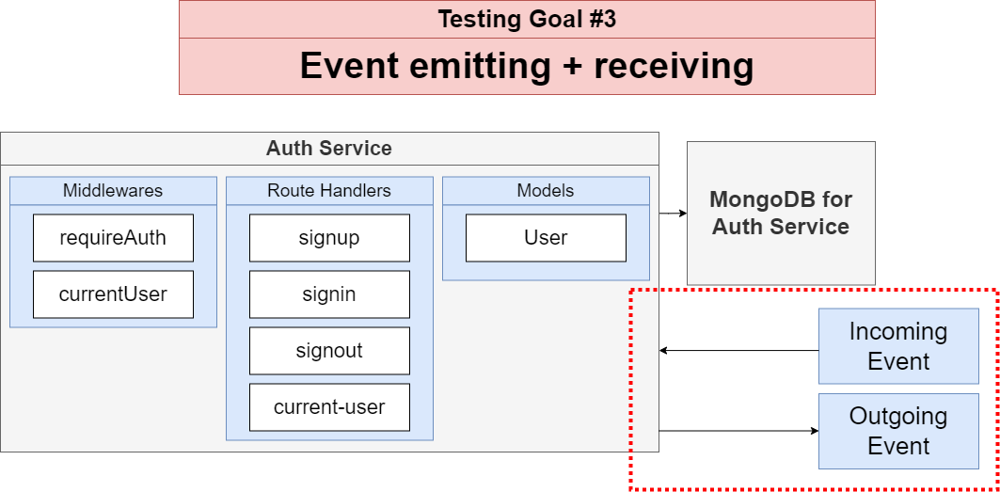
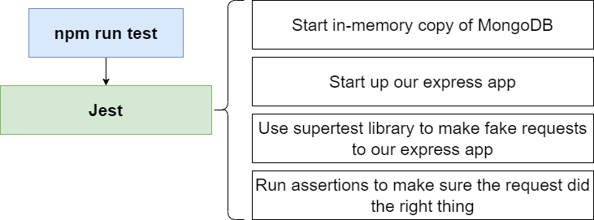

# Testing In Microservices.

[Section 1: Overview about testing in microservice](./Testing-Microservices-1.md))

[**Section 2: Analyze testing strategies in this project**](./Testing-Microservices-2.md)

## Sections 2: Analyze testing strategies in this project

## Table of contents

1. Scope of testing.
2. Testing goal.
3. How we run these test?

## 1. Scope of testing







## 2. Testing goal








## 3. Contract testing

- We are going to run these tests directly from our terminal without using docker

- This implies that our local environment is capable of running each service!

- Simple enough now, but more complex projects might make this hard!


