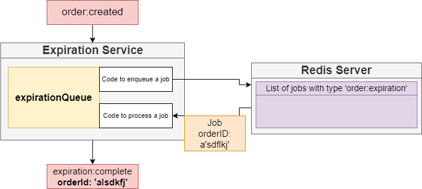
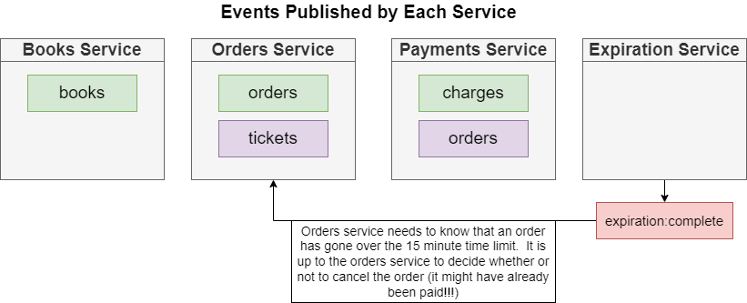

# Order-Service

This service will handle expiration since the order is created.

## 1. Starting On Local

This service is using Nodejs version 16.x.x and Bull JS

```bash
npm install
### Testing
npm run eslint
### Start
npm run start
```

## 2. High Level Design For Expiration Service




## 3. Integrate with NATS

### 3.1. EVENT FLOW:

**LISTENER**

OrderCreatedListener: The listener event for Orders Create new.


**PUBLISHER**

ExpirationCompletePublisher: When the order is expired after the predefine time, 
the service will publish the expiration completed event to NATs.



