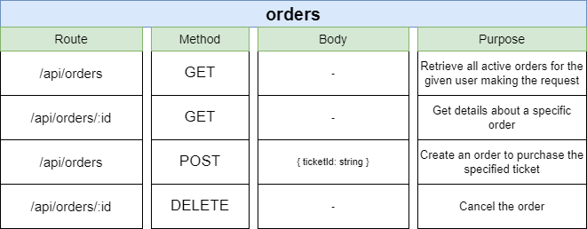
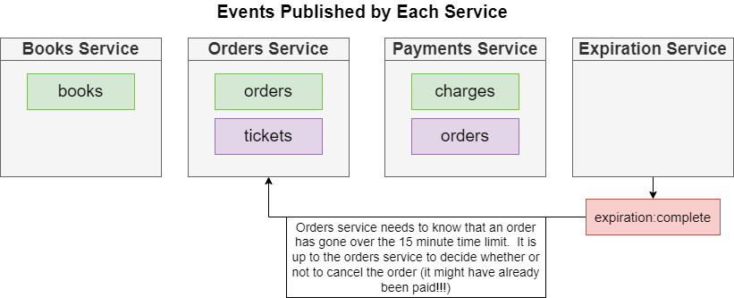

# Order-Service

This service will handle order creation and editing.

## 1. Starting On Local

This service is using Nodejs version 16.x.x

```bash
npm install
### Testing
npm run eslint && npm run test
### Start
npm run start
```

## 2. Routes



After the service runs successfully, the API for the service will be ready.
We can proceed to verify it by testing the API through swagger or postman tools

## 3. Database

Here is the structural database of Order service.


we need each order's doc to have a reference to the Book model to get the necessary information from the book,
which be contained in order (title, price, version).

So to be able doing this, we will use Mongoose Ref/Population Feature
(Population is the process of automatically replacing the specified paths in the document with document(s) from other collection(s). We may populate a single document, multiple documents, a plain object, multiple plain objects, or all objects returned from a query.)


### 3.1 Order Model

#### Describe Properties:

- **Status**: For each order created, a status helps describe the status process of this order.
```bash
    - Created = 'created': When the order has been created,
    and the book it is trying to order has not been reserved

    - Cancelled = 'cancelled': The book the order is trying to reserve has already
    reserved, or when the user has cancelled the orders. The order expire before payment

    - AwaitingPayment = 'awaiting:payment': The order has been successfully reserved the book

    - Complete = 'complete': The order has reserved the book and the user has been
    provided payment successfully
```

- **ExpireAt**: Expiration time from the time the order is created


## 4. Integrate with NATS
Some key features: 
- If no payment is provided after 15 minutes, an order should expire.
- If a payment is provided, the order should be marked as complete.
- If an order expires, the associated book should be marked as not being reserved, and the other order can pick up them
- If a book has been reserved, we should forbid editing the price of the book.
- If an order is canceled after payment is provided, the payment should be refunded.

### 4.1. Event Flow

**LISTENER**

- BookCreatedListener


- BookUpdatedListener


- ExpirationCompleteListener: The listener event for expiration event when the order isn't provided a payment after 15 minutes.



**PUBLISHER**

- OrderCancelledPublisher


- OrderCreatedPublisher


