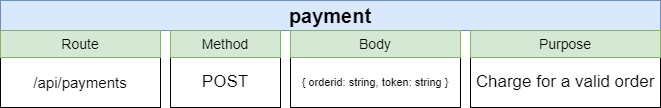
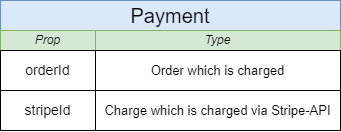
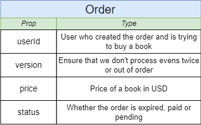
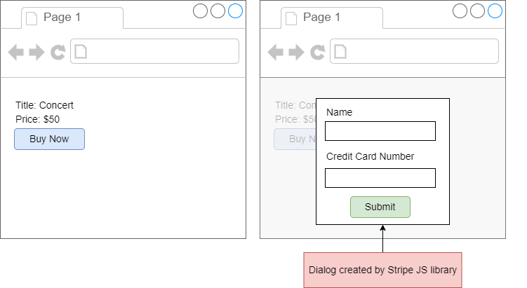
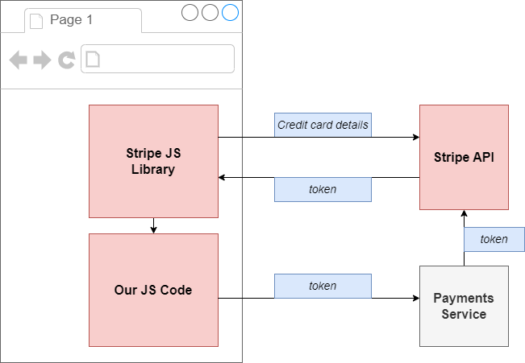
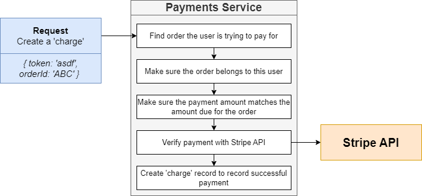
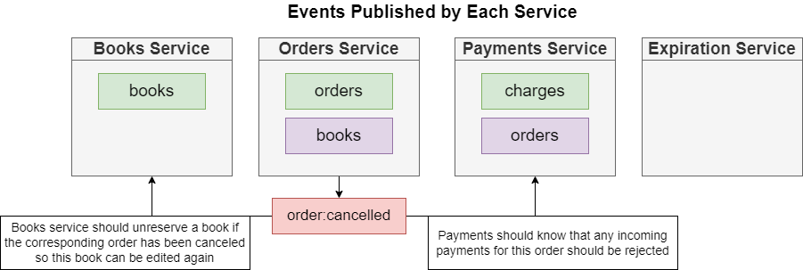
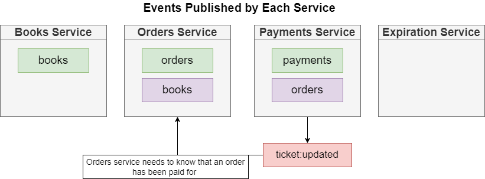

# Payment-Service

This service will make a charge for the valid order.

## 1. Starting On Local

This service is using Nodejs version 16.x.x

```bash
npm install
### Eslint && Testing
npm run eslint && npm run test
### Start
npm run start
```

Docket build:
```bash
docker build -t @huyhoang1001/payments .
```

## 2. Routes



After the service runs successfully, the API for the service will be ready.
We can proceed to verify it by testing the API through swagger or postman tools

## 3. Database

### 3.1 Payment Models

#### Describe Properties:





## 4 Payment Flow With Stripe
- On client service, we will use the stripe js library to create a dialog for payment detail information.




- The client will make a request to Stripe API to get a token charge.




- Payment service will verify the payment with Stripe API and create the charge record to record successful payment




## 5. Integrate with NATS

### 5.1. Event Flow

**LISTENER**

- OrderCancelledPublisher




- OrderCreatedPublisher


**PUBLISHER**

- PaymentCreatedPublisher: The publisher event for payment event when the order is provided a payment successfully.
  



